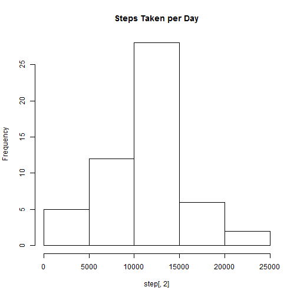
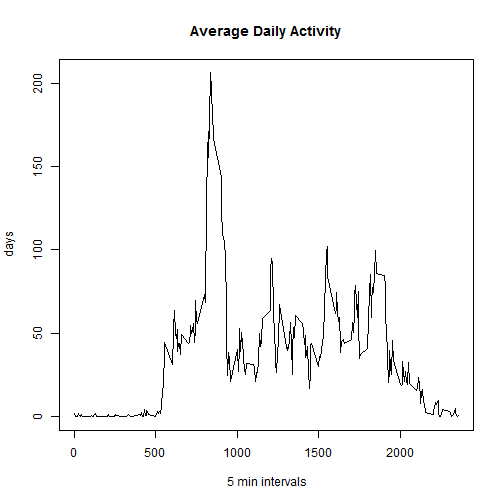
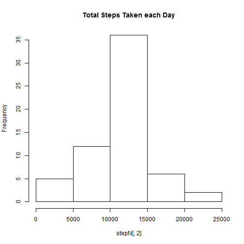
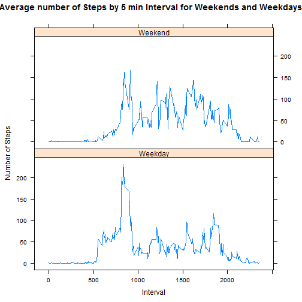

## load packages and call data

```r
library(knitr)
setwd("~/Cousera/ReproducibleResearch/RepData_PeerAssessment1")
act <- read.csv(file="activity.csv",head=TRUE)
attach(act)
```

 
## What is mean total number of steps taken per day?
###  Calculate the total number of steps taken per day

```r
step <- aggregate(steps ~ date, sum, data=act)
```

### Histogram of the total number of steps taken each day

```r
hist(step[,2],main="Steps Taken per Day")
```

 

### Calculate and report the mean and median of the total number of steps taken per day

```r
mean(step[,2])
```

```
## [1] 10766.19
```

```r
median(step[,2])
```

```
## [1] 10765
```
  
 
## What is the average daily activity pattern?
### Make a time series plot of the 5-minute interval and the average number of steps taken, averaged across all days

```r
stepI <- aggregate(steps ~ interval, mean, data=act)
plot(stepI[,1],stepI[,2],main="Average Daily Activity", 
    xlab=" 5 min intervals", ylab="days", type = "l")
```

 
### Which 5-minute interval, on average across all the days in the dataset, contains the maximum number of steps?

```r
stepI[,1][which(stepI[,2]==max(stepI[,2]))]
```

```
## [1] 835
```
 
## Imputing missing values

### Calculate and report the total number of missing values 

```r
sum(is.na(steps))
```

```
## [1] 2304
```

### Strategy for filling in all of the missing values 
- Mean for that 5-minute interval

### Create a new dataset that is equal to the original dataset but with the missing data filled in

```r
new <- act
stepN <- aggregate(steps ~ interval, mean, data=new)
      for (i in stepN[,1]){
          #find out how many are missing for one time interval
          lengthmissing=length(new[is.na(new$steps)&new$interval==i,][,1])
          new[is.na(new$steps)&new$interval==i,][,1]=rep(stepI[,2][stepI[,1]==i],lengthmissing)
        }
```

### Histogram of the total number of steps taken each day, mean and median 

```r
stepN <- aggregate(steps ~ date, sum, data=new)
hist(stepN[,2],main="Total Steps Taken each Day")
```

 

```r
mean(stepN[,2])
```

```
## [1] 10766.19
```

```r
median(stepN[,2])
```

```
## [1] 10766.19
```
  
 
## Are there differences in activity patterns between weekdays and weekends?

### New factor variable in the dataset with two levels - "weekday" and "weekend" 

```r
new$week <- weekdays(as.Date(new$date))
  for (i in 1:length(new$week)){
          if (new$week[i] == "Saturday" || new$week[i] == "Sunday"){
          new$week[i] = "Weekend"
        }else{ new$week[i] = "Weekday"}
  }
new$week <- as.factor(new$week)
```
 
 
### Panel plot containing a time series plot of the 5-minute interval and the average number of steps taken, averaged across all weekday days or weekend days  

```r
library(ggplot2)
library(lattice)
stepN <- aggregate(steps ~ interval+week, mean, data=new)
xyplot(steps ~ interval | week, data = stepN, 
       type = "l", layout = c(1,2), xlab = "Interval", ylab = "Number of Steps", 
       main = "Average number of Steps by 5 min Interval for Weekends and Weekdays")
```

 

    
